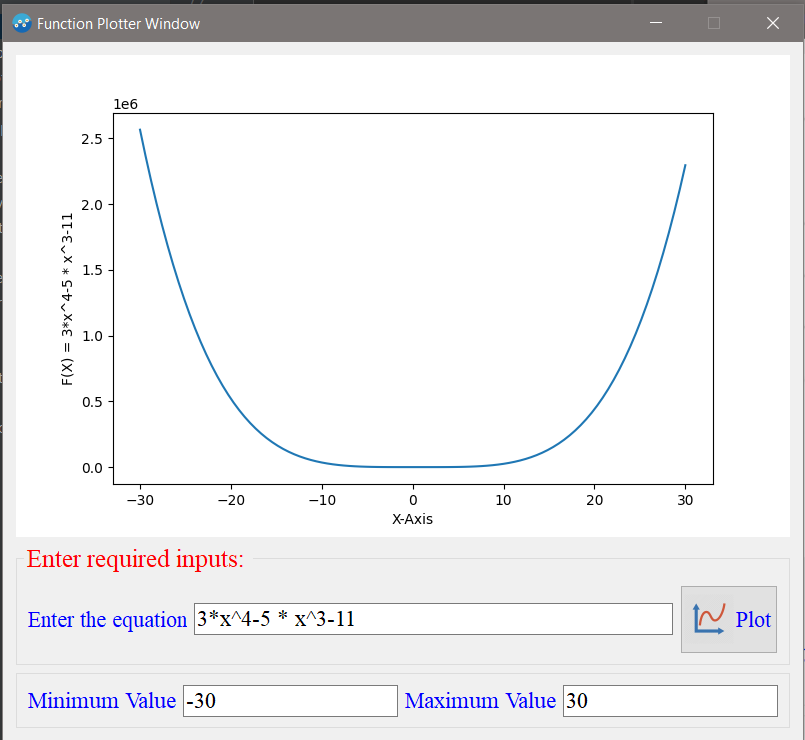
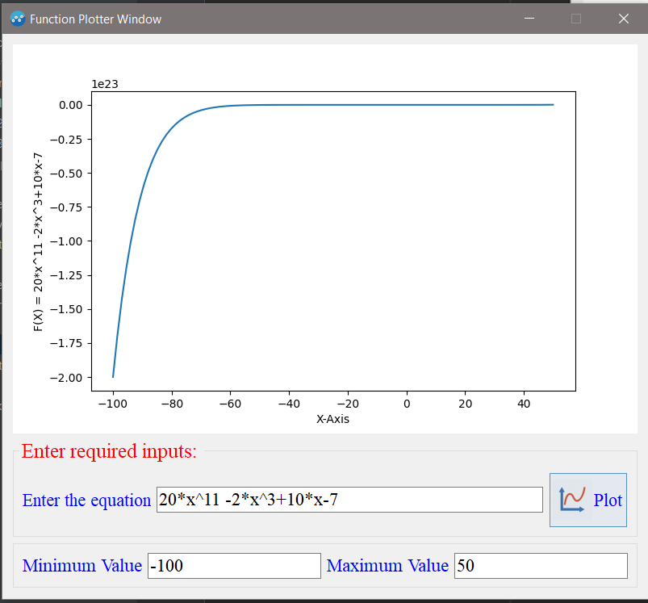
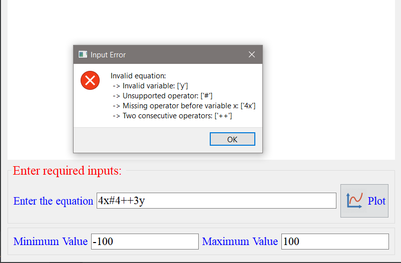
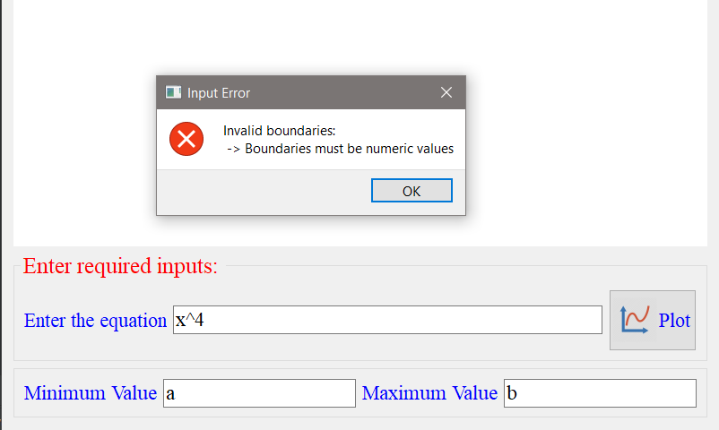

# Function Plotter

A Python GUI program that plots an arbitrary user-entered function.

## Table of Contents

- [Introduction](#introduction)
- [Project Structure](#project-structure)
- [Installation](#installation)
- [Usage](#usage)
- [Examples](#examples)
- [Tests](#tests)
## Introduction

The Function Plotter is a Python GUI application built with PySide2 and matplotlib. It allows users to enter a polynomial equation and specify the range of values for the independent variable. The program then plots the graph of the equation over the specified range.

## Project Structure

The project is structured as follows:

```
├── images/
│   ├── appIcon.png
│   └── buttonIcon.jpg
├── project_snapshots/
│   ├── working_examples/
│   │   ├── example1.png
│   │   ├── exapmle2.png
│   │   └── example3.png
│   └── wrong_examples/
│      ├── example1.png
│      ├── example2.png
│      ├── example3.png
│      └── example4.png
├── src/
│   ├── equationSolver.py
│   └── function_plotter_gui.py
└── tests/
    ├── test_EquationSolver.py
    └── test_gui.py
```

- The `images` folder contains the necessary images used in the GUI.
- The `project_snapshots` folder contains snapshots of working and incorrect examples of the application.
- The `src` folder contains the main source code files:
  - `equationSolver.py` contains the `EquationSolver` class for validating and solving equations over a specific domain.
  - `function_plotter_gui.py` contains the `FunctionPlotter` class that represents the PySide2 GUI.
- The `tests` folder contains unit tests for the `EquationSolver` class and the PySide2 GUI.

## Installation

To run the Function Plotter, you need to install the following dependencies:

- Python 
- PySide2
- NumPy
- matplotlib


## Usage

To launch the Function Plotter, execute the following command:

```shell
python src/function_plotter_gui.py
```

The GUI window will appear, allowing you to enter the equation and the range of values. Click the "Plot" button to generate the plot.

## Examples

Here are some screenshots of the Function Plotter application:

- **Correct Examples:**
  
  
  
  

- Incorrect Examples:
  
  
  
  

## Tests

The project includes unit tests for both the `EquationSolver` class and the PySide2 GUI. The tests can be found in the `tests` folder:

- `test_equationSolver.py` contains tests for the `EquationSolver` class.
- `test_gui.py` contains tests for the PySide2 GUI.

To run the tests, use the following command:

```shell
pytest .\test\
```

